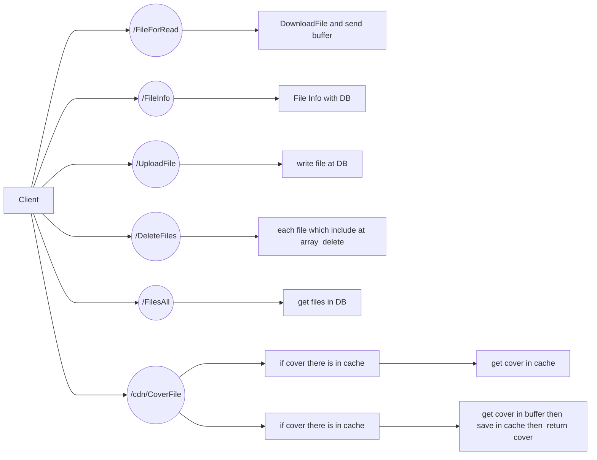
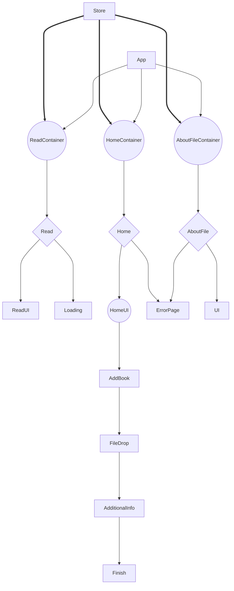

# PDF READER 
It's my pet project. On **React/Redux** and **Node.js/Mongo DB**

[*link video* ](https://www.youtube.com/watch?v=gkgss86uMcE)

# Stack 

 **Backend**:new_moon:
 - [Fastify](https://www.fastify.io/)
 - [Mongodb](https://www.mongodb.com/)
 - [Node-poppler](https://github.com/Fdawgs/node-poppler)

**Frontend**:full_moon:

 - [React](https://github.com/facebook/react)
 - [Redux-Toolkit](https://github.com/reduxjs/redux-toolkit)
 - [Material-UI](https://github.com/mui/material-ui)
 - [Axios](https://github.com/axios/axios)
 - [React-PDF](https://github.com/wojtekmaj/react-pdf)
 - [Testing-Library](https://github.com/testing-library)

## How it works.
**Backend**:new_moon:

**Frontend**:full_moon:

